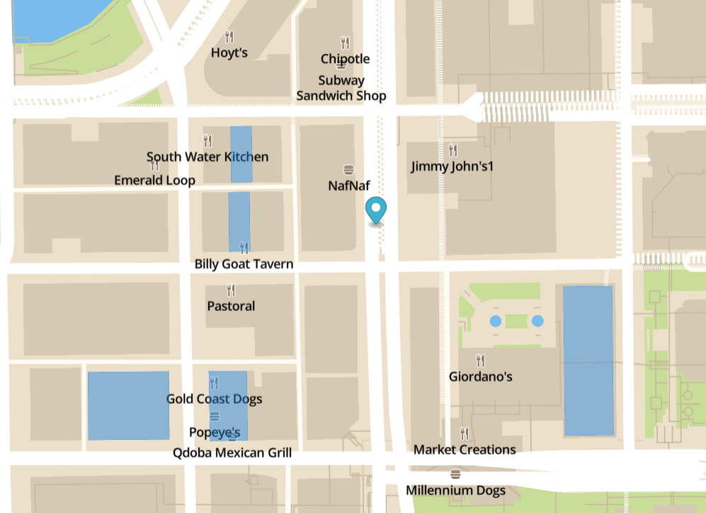
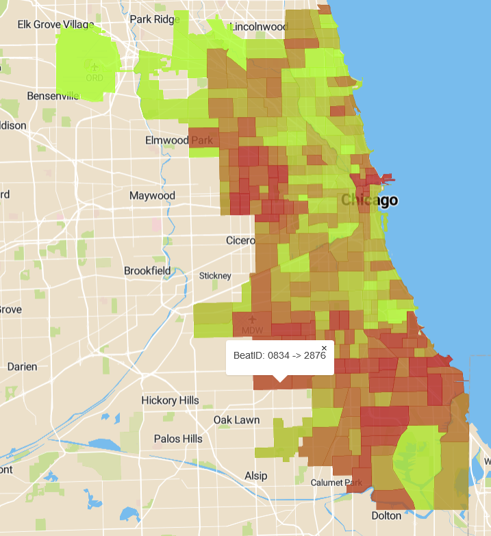
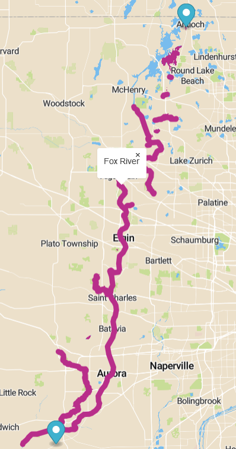

# Overview

This application helps policemen do their jobs more effectively, and show the policemen some statistics about their beats. The functionalities implemented in this application are:
- search bars, fast-foods, restaurants, nightlubs, parking lots and hospitals by proximity of your location
- Show chloroperth map, which shows arrests made by beat
- find all the water objects between two markers, which is created if the policemen are looking for a suspect
- This application works only in state of Illinois, and city of Chicago

This is it in action:
#### First functionality

#### Second functionality

#### Third functionality


The application has 2 separate parts, the client which is a [frontend web application](#frontend) using mapbox API and mapbox.js and the [backend application](#backend) written in [Python](https://www.python.org/), backed by PostGIS. The frontend application communicates with backend using a [REST API](#api).

# Frontend

The frontend application is a static HTML page (`index.html`), which shows a mapbox.js widget. It is diplaying bars, restaurants, nightlubs, fast-foods, parking lots and hotels. This information is for policemen, to find place to eat, where to park and in case of emergency where the hospital is in vicinity. Next use case shows the arrests by beats. This shows policemen how prepared they should be when patrolling the area. And last show every water object between two points. This helps policemen check every water body the suspect could have passed, to lose trail from the search dogs.

All relevant frontend code is in `mapbox.js`, with some additional functionality in `funcions.js`, which is referenced from `index.html`. The frontend code is very simple, its only responsibilities are:
- detecting user's location, user determines his location by dragging the marker
- displaying the sidebar with the ability to switch functionalities
- displaying geo features by overlaying the map with a geojson layer, the geojson is provided directly by backend APIs

# Backend

The backend application is written in Python, which is running on flask server, and is responsible for querying geo data.

## Data

Map data is coming from Open Street Maps. The downloaded part is only state of Illinois and imported using `osm2pgsql` tool into standard OSM schema. The query is made to the database and is then converted to json using `jsonify` library in python. The data which is retrieved by user is:
- Name - name of the object
- Amenity - this is used mostly in bar, fast-food, nightclubs, and parking
- Building - which identifies hospital
- Geojson - Which contains whole geometry of the object which is supposed to be vizualized

Addtitional data which was used in this application came from Chicago city Database. The 2 datasets were:

- Shapefile of the ciry beats which policemen watch over, this information was imported to database using `osm2pgsql`

- Crimes done in the city of chicago since the 2014 to 2017. In this data were a lot of thing which we didnt need, so we filtered the `.csv` file using [filter.py](data/filter.py). Which output was then imported into sql database using script:

``` sql
CREATE TABLE crime_data
(
  id serial NOT NULL,
  beat character varying(10),
  month_date date,
  crimes_count int,
  CONSTRAINT persons_pkey PRIMARY KEY (id)
)
COPY crime_data(beat, month_date, crimes)
FROM 'C:\path\to\csv\file' DELIMITER ',' CSV HEADER; 
```

## Api

**First functionality**

`GET /points?latitude=25346&longitude=46346123`

The first script uses ST_DWithin to find all the points and polygons which match the criteria in the `WHERE` clause. We also use `UNION ALL` to combine the result sets from two selects

``` sql
SELECT name, amenity, building, ST_AsGeoJSON(ST_Transform(way, 4326)::geography) FROM planet_osm_point 
WHERE ST_DWITHIN(ST_SetSRID(ST_MakePoint(%(longitude)f, %(latitude)f), 4326)::geography,ST_Transform(way, 4326)::geography,200)
AND name IS NOT NULL AND amenity IN ('fast_food', 'bar', 'restaurant', 'nightclub')
UNION ALL ( SELECT b.name, b.amenity, b.building, ST_AsGeoJSON(ST_Transform(b.way, 4326)::geography) FROM planet_osm_polygon b 
WHERE ST_DWITHIN(ST_SetSRID(ST_MakePoint(%(longitude)f, %(latitude)f), 4326)::geography,ST_Transform(b.way, 4326)::geography,200)
AND (b.building = 'hospital' OR b.amenity = 'parking'))
```


**Second functionality**

`GET /beats`

This select fairly simply joins two selects by `beat id` which return the total number of crimes arrested in the beat. Most magic is then done on front end part of the application.

```sql 
SELECT b.beat_num, SUM(cd.crimes_count), ST_AsGeoJSO(ST_SetSRI (b.geom, 4326)::geography) FROM chicago_beats b
INNER JOIN crime_data AS cd ON cd.beat = TRIM (LEADING '0' FROM b.beat_num)
GROUP BY b.beat_num, b.geom
```

**Thrid functionality**

`GET /water?latitude1=25346&longitude1=46346123&latitude2=45884&longitude2=55889`

This select has to create a line from two points and then uses ST_Intersects to find every object which matches the `WHERE` clause. Here we too use `UNION ALL` to  combine the result sets from two selects.

``` sql 
SELECT d.name, d.waterway, d.natural, ST_AsGeoJSON(ST_Transform(d.way, 4326)::geography) FROM planet_osm_polygon d
WHERE (d.waterway IN ('river', 'stream', 'canal', 'ditch') OR d.natural IN ('water', 'wetland', 'bay'))
AND ST_Intersects(ST_Transform(ST_MakeLine( ST_SetSRID(ST_MakePoint(%(longitude1)f, %(latitude1)f), 4326), 
ST_SetSRID(ST_MakePoint(%(longitude2)f, %(latitude2)f), 4326)), 3857), d.way)	
UNION ALL (SELECT b.name, b.waterway, b.natural, ST_AsGeoJSON(ST_Transform(b.way, 4326)::geography) FROM planet_osm_line b
WHERE (b.waterway IN ('river', 'stream', 'canal', 'ditch') OR b.natural IN ('water', 'wetland', 'bay'))
AND ST_Intersects(ST_Transform(ST_MakeLine( ST_SetSRID(ST_MakePoint(%(longitude1)f, %(latitude1)f), 4326), 
ST_SetSRID(ST_MakePoint(%(longitude2)f, %(latitude2)f), 4326)), 3857), b.way
```

### Response

API calls return json responses with witch contains list of objects. 
